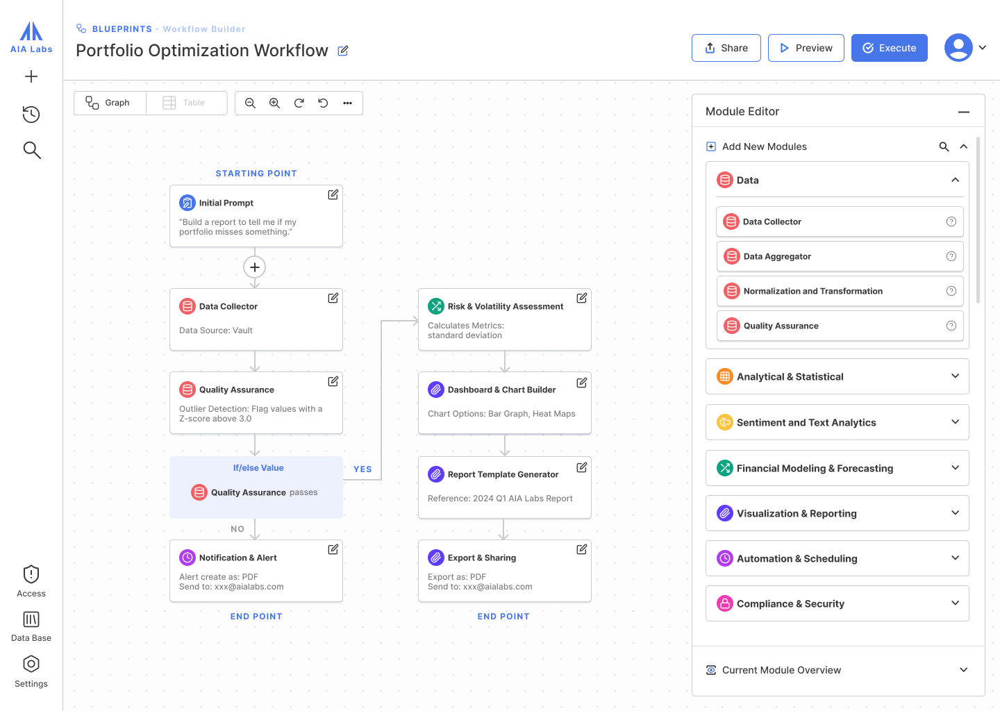

# Workflow Builder

## Overview
This feature adds a workflow builder to the existing application, allowing users to create, manage, and execute multi-step LLM workflows. 
Each workflow consists of interconnected nodes (steps) that form a graph using LangGraph.js, where outputs from one step can be used as inputs to subsequent steps.

Eventually, this will be extended to enable dynamic creation of workflows as well as the ability to go from workflow back to code.

To start, we just want to get a basic workflow builder running.

## Instructions
Please do not spend more than 2 hours on this. I do want you to have some code to discuss (even if it's just an integration of an existing workflow product), but either way I don't expect the whole feature to be completed in 2 hours.

It's fine if it's a rough first cut, I mostly want to see if you can get something working and then discuss how you would both harden and extend it (or start over).
Make sure to give yourself some time towards the end to think through what you'd change or do next.

This particular feature has been implemented by many other products, our best path might be to integrate with one of those products. However, I also want to get a sense of how much work it is to replicate the basic functionality as I know we'll want to customize much of the UI/UX.
You can use any other open source workflow implementation you want. The main requirement is that we're able to fully cusotmize the user experience/flow.
LangGraph has their own visual editor. Dify.ai and n8n have open source versions as well. Lastly, [Flock](https://github.com/Onelevenvy/flock/tree/main) might be worth looking at.

I used this NextJS template so you had something to start from, but I'm also fine if  you want to start from scratch or use a different framework, completely up to you.

## Key Features

### 1. Workflow Management
- Create new workflows with a name and description
- List, edit, and delete existing workflows
- Save workflows to the database
- Import/export workflows (JSON format)

### 2. Step (Node) Configuration
- Add, edit, and remove steps in a workflow
- Configure each step with:
  - Name and description
  - Selected LLM model
  - Optional tools to include
  - Input configuration (user-provided or from previous steps)
  - Structured output schema (optional)
  - Connections to other steps

### 3. Workflow Execution
- Execute workflows with defined inputs
- Stream results in real-time
- View execution history and logs
- Debug mode to inspect intermediate steps

### 4. Workflow Variables
- Define global variables for the workflow
- Use variables across different steps

### 5. UI/UX (Using ReactFlow or similar)
- Interactive graph-based workflow builder using ReactFlow
- Drag-and-drop interface for adding and connecting steps
- Custom node components for different step types
- Minimap for easy navigation of complex workflows
- Controls for zooming, panning, and selecting nodes
- Responsive design for different screen sizes

## Technical Requirements

### 1. Database Extensions
- New schema tables for:
  - Workflows (metadata, owner)
  - Steps (configuration, LLM settings, tools, system/developer message, user message)
  - Connections (relationships between steps)
  - Executions (history, inputs, outputs)
- Relations with existing user model

### 2. Backend
- API endpoints for workflow CRUD operations
- Integration with LangGraph.js for workflow execution
- Streaming results using Server-Sent Events
- Authentication and authorization for workflows

### 3. Frontend
- ReactFlow implementation for the graph-based workflow builder
- Custom node components for different step types
- Forms for configuring step properties
- Real-time visualization of workflow execution

## User Flow

1. User navigates to the Workflows page
2. User can see a list of their existing workflows or create a new one
3. When creating/editing a workflow:
   - User can drag and drop steps onto the canvas
   - User can connect steps by dragging from one node's output to another node's input
   - User can configure each step's properties (LLM, tools, inputs/outputs)
   - User can save the workflow
4. When executing a workflow:
   - User provides any required input variables
   - User can see real-time progress and outputs from each step
   - Results are displayed and can be saved

## Optional Technical Dependencies

- ReactFlow (`@xyflow/react`) for the workflow UI
- LangGraph.js for workflow execution
- Server-Sent Events for real-time streaming
- PostgreSQL for data storage (using existing Drizzle ORM setup) 
