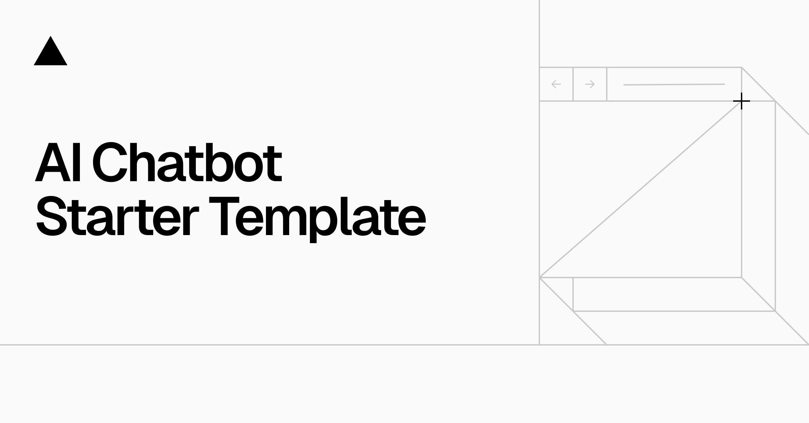

### Welcome:

I'm leaving the contents of the Next.JS readme intact below, but if you are looking for instructions on completing the take-home assessment for BW, please 
see Feature.md 

------


<a href="https://chat.vercel.ai/">
  
  <h1 align="center">Next.js AI Chatbot</h1>
</a>

<p align="center">
  An Open-Source AI Chatbot Template Built With Next.js and the AI SDK by Vercel.
</p>

<p align="center">
  <a href="#features"><strong>Features</strong></a> ·
  <a href="#model-providers"><strong>Model Providers</strong></a> ·
  <a href="#running-locally"><strong>Running locally</strong></a>
</p>
<br/>

## Features

- [Next.js](https://nextjs.org) App Router
  - Advanced routing for seamless navigation and performance
  - React Server Components (RSCs) and Server Actions for server-side rendering and increased performance
- [AI SDK](https://sdk.vercel.ai/docs)
  - Unified API for generating text, structured objects, and tool calls with LLMs
  - Hooks for building dynamic chat and generative user interfaces
  - Supports xAI (default), OpenAI, Fireworks, and other model providers
- [shadcn/ui](https://ui.shadcn.com)
  - Styling with [Tailwind CSS](https://tailwindcss.com)
  - Component primitives from [Radix UI](https://radix-ui.com) for accessibility and flexibility
- Data Persistence
  - [Vercel Postgres powered by Neon](https://vercel.com/storage/postgres) for saving chat history and user data
  - [Vercel Blob](https://vercel.com/storage/blob) for efficient file storage
- [NextAuth.js](https://github.com/nextauthjs/next-auth)
  - Simple and secure authentication

## Model Providers

This template ships with [OpenAI](https://openai.com) as the default chat model. However, with the [AI SDK](https://sdk.vercel.ai/docs), you can switch LLM providers to [Anthropic](https://anthropic.com),  [xAI](https://x.ai), [Cohere](https://cohere.com/), and [many more](https://sdk.vercel.ai/providers/ai-sdk-providers) with just a few lines of code.


## Running locally

You will need to use the environment variables [defined in `.env.example`](.env.example) to run Next.js AI Chatbot. It's recommended you use [Vercel Environment Variables](https://vercel.com/docs/projects/environment-variables) for this, but a `.env` file is all that is necessary.

> Note: You should not commit your `.env` file or it will expose secrets that will allow others to control access to your various AI and authentication provider accounts.

1. Enusre you have postgres running locally (either via docker or a local install)
2. Update the `.env` file with the keys we sent over

```bash
pnpm install
pnpm db:migrate
pnpm dev
```

Your app template should now be running on [localhost:3000](http://localhost:3000/).
You'll need to create a new user to test the app, the password you use needs to be at least 6 characters long.
